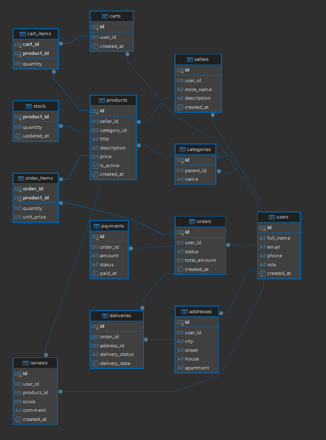

# Отчёт по лабораторной работе №1
**Тема:** Проектирование и создание структуры базы данных маркетплейса

---

## 1. Бизнес-правила маркетплейса

База данных спроектирована для торговой площадки с независимыми продавцами и покупателями. Логика предметной области описывается следующими правилами:

1. **Пользователи:** У каждого пользователя уникальный email. Роль по умолчанию — покупатель (`customer`), но пользователь также может быть продавцом (`seller`) или администратором (`admin`).
2. **Продавцы:** Продавцом становится только зарегистрированный пользователь. Один пользователь может владеть максимум одним магазином (связь 1:0..1).
3. **Категории:** Каталог организован в виде дерева неограниченной вложенности через список смежности. Дочерняя категория ссылается на родительскую через `parent_id`, у корневых категорий `parent_id IS NULL`.
4. **Товары:** Товар обязательно закреплён за одним продавцом и одной категорией. Цена товара всегда строго положительна (`CHECK (price > 0)`).
5. **Склад:** У каждого товара ведётся складской учёт в отдельной таблице `stock` (связь 1:1). Количество не может быть отрицательным (`CHECK (quantity >= 0)`).
6. **Корзина:** Пользователь имеет не более одной активной корзины. В корзину нельзя добавить неположительное количество товара (`CHECK (quantity > 0)`).
7. **Заказы и позиции:** Заказ оформляет покупатель. Товары связываются с заказом через отношение «многие-ко-многим» в промежуточной таблице `order_items`.
8. **Фиксация цены:** В позиции заказа (`order_items`) сохраняется цена товара на момент покупки (`unit_price`). Изменение цены продавцом в каталоге не меняет стоимость уже созданного заказа.
9. **Оплата и доставка:** К заказу привязывается одна запись об оплате (`payments`) и одна доставка (`deliveries`) по выбранному адресу пользователя.
10. **Отзывы:** Покупатель может оставить оценку от 1 до 5 и текстовый комментарий. На один товар один пользователь может написать только один отзыв (`UNIQUE (user_id, product_id)`).

---

## 2. Логическая схема и ER-диаграмма

В схеме базы данных реализовано 13 сущностей:
* **Связи «многие-ко-многим» (M:N):**
  * `orders` $\leftrightarrow$ `products` (через ассоциативную таблицу `order_items`).
  * `carts` $\leftrightarrow$ `products` (через ассоциативную таблицу `cart_items`).
* **Иерархическая связь (дерево):**
  * В таблице `categories` поле `parent_id` ссылается на `id` этой же таблицы.
* **Связи 1:1 и 1:0..1:**
  * `users` $\rightarrow$ `sellers` (ограничение `UNIQUE` на `user_id`).
  * `products` $\rightarrow$ `stock` (`product_id` — одновременно PK и FK).
  * `orders` $\rightarrow$ `payments` и `orders` $\rightarrow$ `deliveries`.

> **Скриншот ER-диаграммы из DBeaver:**  
> 

---

## 3. Нормализация схемы до 3НФ и разбор аномалий (ТЗ п. 3)

Схема базы данных находится в третьей нормальной форме (3НФ):
* **1НФ:** все атрибуты атомарны (нет массивов, списков и повторяющихся групп в ячейках).
* **2НФ:** схема в 1НФ, и в таблицах с составными ключами (`order_items`, `cart_items`) все неключевые поля зависят от полного составного ключа, а не от его части.
* **3НФ:** схема во 2НФ, и отсутствуют транзитивные зависимости (неключевые поля не зависят от других неключевых полей).

### Пример аномалии до нормализации
Если бы мы объединили данные заказов, клиентов и товаров в одну таблицу `orders_raw`:

| order_id | order_date | user_id | user_email | product_id | product_name | product_price | qty |
|:---:|:---:|:---:|:---:|:---:|:---:|:---:|:---:|
| 1 | 2026-10-01 | 10 | artem@mail.ru | 101 | Ноутбук | 60000.00 | 1 |
| 2 | 2026-10-02 | 10 | artem@mail.ru | 102 | Мышь | 1500.00 | 2 |

В такой структуре возникают три классические аномалии:
1. **Аномалия вставки:** Нельзя добавить нового пользователя без оформления фиктивного заказа. Нельзя добавить товар в каталог, пока его кто-нибудь не купит.
2. **Аномалия обновления:** Если пользователь меняет свой email, придётся обновлять его во всех строках его заказов. Если обновить не везде — данные потеряют согласованность.
3. **Аномалия удаления:** При удалении заказа №2 удалится единственная запись о товаре «Мышь», и он пропадёт из каталога магазина.

**Устранение аномалий:**  
Таблица декомпозирована на четыре независимых отношения: `users`, `products`, `orders` и ассоциативную таблицу `order_items`. Теперь сущности изолированы, дублирование исключено, а изменение email происходит ровно в одной строке таблицы `users`.

---

## 4. Обоснование выбора ключей и правил удаления (ТЗ п. 4)

### Первичные ключи
1. **Суррогатные ключи (`BIGINT GENERATED ALWAYS AS IDENTITY`):**  
   Для сущностей (`users`, `products`, `orders` и др.) выбраны автоинкрементные числовые идентификаторы. Они не зависят от предметной области, никогда не меняются, занимают 8 байт и быстрее обрабатываются в B-Tree индексах, чем строки вроде email или артикулов.
2. **Составные ключи:**  
   В таблицах `order_items (order_id, product_id)` и `cart_items (cart_id, product_id)` первичный ключ сформирован из двух внешних ключей. Это аппаратно исключает дублирование одного и того же товара в заказе или корзине.

### Правила ссылочной целостности `ON DELETE`
* **`CASCADE`:** используется для жёстко подчинённых сущностей. При удалении пользователя удаляется его корзина, магазин и отзывы. При удалении заказа каскадно удаляются позиции заказа (`order_items`), оплата и доставка.
* **`RESTRICT`:** используется для защиты финансовой и исторической целостности. Нельзя удалить продавца или товар, если этот товар фигурирует в оформленных заказах. Нельзя удалить категорию, пока к ней привязаны товары или подкатегории.

---

## 5. Словарь данных (ТЗ п. 6)

| Таблица | Столбец | Тип данных | Ограничения | Назначение |
|:---|:---|:---|:---|:---|
| **users** | `id` | `BIGINT` | `PK, IDENTITY` | Суррогатный идентификатор пользователя |
| | `full_name` | `VARCHAR(150)` | `NOT NULL` | Имя / ФИО пользователя |
| | `email` | `VARCHAR(255)` | `NOT NULL, UNIQUE` | Адрес электронной почты (логин) |
| | `phone` | `VARCHAR(30)` | — | Номер телефона |
| | `role` | `VARCHAR(30)` | `NOT NULL, CHECK` | Роль: customer, seller, admin |
| | `created_at` | `TIMESTAMPTZ` | `NOT NULL, DEFAULT now()` | Дата и время регистрации |
| **sellers** | `id` | `BIGINT` | `PK, IDENTITY` | Идентификатор магазина |
| | `user_id` | `BIGINT` | `FK, UNIQUE, CASCADE` | Владелец магазина (пользователь) |
| | `store_name` | `VARCHAR(150)` | `NOT NULL, UNIQUE` | Публичное название магазина |
| | `description` | `TEXT` | — | Описание магазина |
| | `created_at` | `TIMESTAMPTZ` | `NOT NULL, DEFAULT now()` | Дата создания магазина |
| **categories** | `id` | `BIGINT` | `PK, IDENTITY` | Идентификатор категории |
| | `parent_id` | `BIGINT` | `FK, RESTRICT` | Ссылка на родительскую категорию

## 6. Ответы на контрольные вопросы (стр. 18)

1. **Что такое реляционная модель данных и что в ней называют отношением, кортежем и атрибутом?**  
   Это способ организации данных в виде двумерных связанных таблиц. Отношение — это таблица со схемой. Кортеж — это строка (одна запись). Атрибут — это именованная колонка с заданным типом данных.
2. **Чем отличаются концептуальная, логическая и физическая модели данных?**  
   Концептуальная определяет сущности и связи между ними без деталей реализации. Логическая добавляет все атрибуты, типы связей, первичные и внешние ключи. Физическая модель — это конкретные SQL-таблицы с типами СУБД (PostgreSQL), ограничениями и индексами.
3. **Что такое первичный ключ и какие требования к нему предъявляются?**  
   Это столбец или набор столбцов для однозначной идентификации каждой строки. Требования: уникальность значений, обязательность (запрет `NULL`) и неизменяемость во времени.
4. **В чём различие между суррогатным и естественным ключом?**  
   Естественный ключ формируется из реальных атрибутов (email, паспорт, ИНН). Суррогатный — искусственный числовой идентификатор (`IDENTITY`). Естественный ключ нагляден, но нестабилен при изменениях в жизни. Суррогатный ключ компактен, стабилен и ускоряет поиск по индексам.
5. **Что такое внешний ключ и как он обеспечивает ссылочную целостность?**  
   Это колонка дочерней таблицы, хранящая первичный ключ родительской таблицы. СУБД гарантирует, что нельзя создать дочернюю запись с несуществующей ссылкой или удалить родителя, нарушив связи.
6. **Как в реляционной модели реализуется связь «многие-ко-многим»?**  
   Через третью (ассоциативную) таблицу, содержащую два внешних ключа на связываемые сущности (например, `order_items`), которые вместе образуют составной первичный ключ.
7. **Как смоделировать иерархические данные (дерево категорий) одной таблицей?**  
   С помощью списка смежности: в таблицу добавляется столбец самоссылки `parent_id REFERENCES categories(id)`. У корневых категорий `parent_id` остаётся пустым (`NULL`).
8. **Какие ограничения целостности поддерживает PostgreSQL и что задаёт каждое из них?**  
   * `PRIMARY KEY`: уникальность и запрет `NULL`.  
   * `FOREIGN KEY`: проверка ссылочной целостности.  
   * `NOT NULL`: обязательное заполнение поля.  
   * `UNIQUE`: запрет дубликатов.  
   * `CHECK`: проверка логического условия.  
   * `DEFAULT`: автоматическое значение при вставке.
9. **Что такое нормализация и какие аномалии она устраняет? Сформулируйте требования 1НФ, 2НФ и 3НФ.**  
   Это процесс устранения избыточности структуры, предотвращающий аномалии вставки, обновления и удаления.  
   * 1НФ: значения атрибутов атомарны.  
   * 2НФ: выполнена 1НФ, и все неключевые поля зависят от полного первичного ключа.  
   * 3НФ: выполнена 2НФ, и неключевые поля не зависят от других неключевых полей.
10. **Для чего нужны правила ON DELETE RESTRICT и ON DELETE CASCADE и чем они различаются?**  
    Они определяют поведение СУБД при удалении родительской записи. `CASCADE` автоматически